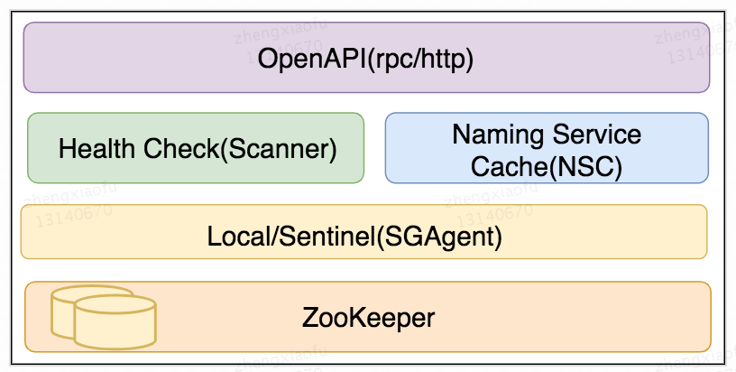
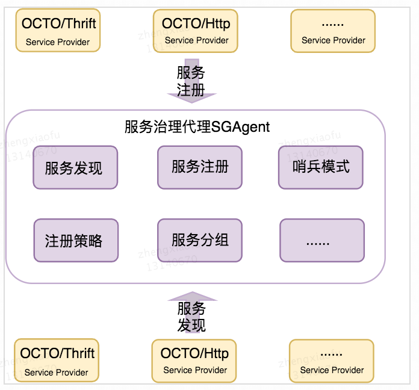
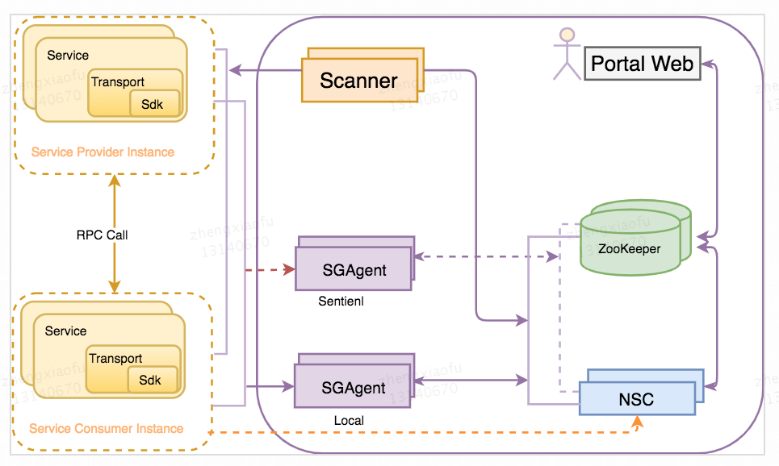
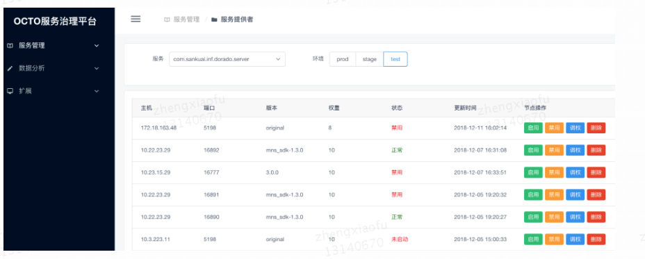
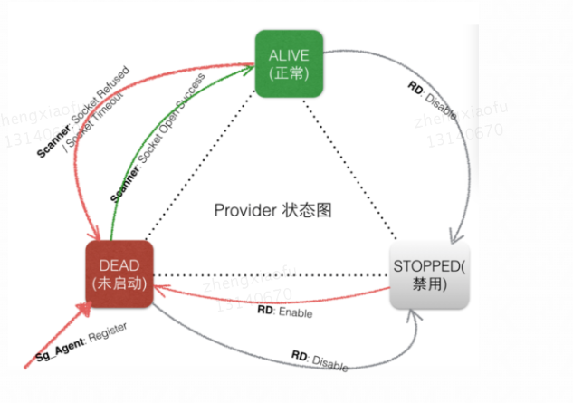

# OCTO-NS

## 背景及概念

 OCTO-NS
 是美团OCTO服务治理体系中负责命名服务的系列模块，包括[C++ SDK](sdk/mns-sdk/docs/mns_sdk_api.md)、[Java
 SDK](sdk/mns-invoker)、
 [基础代理SGAgent](sg_agent)、[命名服务缓存NSC](nsc)、[健康检查服务Scanner](scanner)、[ZooKeeper](https://zookeeper.apache.org/)
 ，搭配管理平台 [OCTO-Portal](https://github.com/Meituan-Dianping/octo-portal) 用户能够便捷的进行服务运营交互。

 OCTO-NS
 基于服务描述信息（tags+weight）实现服务注册/发现、路由分组、负载均衡、健康检测等功能，利用这些服务治理功能用户可以专注于业务逻辑开发、能够追踪线上服务状态、快速处置异常风险。OCTO-NS提升了业务对于服务的运营能力，其总体架构图如下:

  

* 服务Service

  通过自定义接口提供给消费端的软件功能，OCTO目前支持RPC、HTTP服务。

* 服务名 ServiceName

  服务标识，可映射到指定服务；OCTO体系中通过AppKey字段表示服务名。

* 服务提供者 Service Provider

  是指提供服务的被调用一方。

* 服务消费者 Service Consumer

  是指发起对某个服务调用的一方。

* 注册中心

  注册中心存储服务描述信息用以实现命名服务整个功能。服务在启动时将服务信息上报到注册中心，服务消费者从注册中心获取对应的服务提供者信息。健康检查组件会根据对服务节点的检测结果更新注册中心服务状态信息。

* 服务注册(Service Registry)

  服务提供者启用后向注册中心上报服务信息的流程。

* 服务发现(Service Discovery)

  服务消费者获取服务提供者信息的流程。

* 权重

  浮点数，是负载均衡抉择服务端流量配比的重要指标；业务和路由规则会对权重进行调整。

* 服务分组(Service Group)

  是业务自定义的服务提供者和服务消费者之间的调用约束关系。

* 健康检查(Health Check)

  服务节点的端口/进程存活状态的检查。OCTO-NS体系中通过Scanner执行健康扫描，并更新服务描述信息到注册中心。

## 架构特点
* 模块解耦功能拆分

  通信框架(C++版本whale、Java版本Dorado)、服务治理代理(SGAgent)、健康检查服务(Scanner)、服务治理平台(OCTO-Portal)。

* 代理模式轻量化框架

  服务治理策略实现下移到代理组件SGAgent，精简框架功能，提升框架稳定性。

 
  

* 水平扩展的代理模块(SGAgent)
    如上所述，SGAgent实现了服务治理如注册、发现、路由、策略等重要功能，简化服务消费者和服务提供者使用的通信框架。

    服务治理代理从部署上分为本地和哨兵模式两种，当本地SDK到SGAgent不可用时可切换到哨兵集群，保证服务平滑扩展。

* 统一服务状态检查服务(Scanner)

   Scanner以周期扫描形式对服务进行探活检测，并更新服务状态到注册中心。

* 高可用

   调用链容灾：OCTO-NS各组件的本地缓存机制，提升了整体系统的容灾能力。链路中后台的某个组件发生故障时，可以使用缓存正常提供服务治理功能。

   哨兵模式：本地SGAgent不可用时，降级（FallBack）到哨兵集群进行服务治理。

##  架构介绍

  

   OCTO-NS由sdk、SGAgent、NSC、Scanner和ZooKeeper组成，使用OCTO-Portal管理端实现可视化服务营运操作，例如更改服务提供者状态、调整权重。服务提供者启动后，通信框架主动发起注册操作，上报服务描述信息接入OCTO-NS。接下来分模块对OCTO-NS进行介绍。

### 服务治理代理SGAgent

  **服务注册/发现**：这是命名服务的基本功能，注册是提供者上报服务描述信息；发现是消费者根据AppKey获取对应服务描述信息。分为增量和通用两种方式，通用方式是指添加Provider的服务描述信息到对应AppKey下面，为服务列表增加新的成员；增量方式是指一个包含多种ServiceName接口类型的AppKey，通过在注册中心建立ServiceName和AppKey的双向映射，可实现ServiceName粒度的服务注册/发现功能。

  **服务分组**：根据分组信息，SGAgent调整服务节点权重，定制化流量负载。用户可根据需求自定义分组规则，服务分组需要进行事先配置，启动后方能生效。不同分组规则根据优先级排序，优先级高者生效。执行服务分组规则时，对于服务列表中匹配失败的节点进行降权处理，流量极低概率进入降权后的节点（未来管理页面将提供可选按钮，决定降权还是删除规则外服务节点）。目前支持的服务分组策略如下：

  a.自定义路由分组：在服务端配置该策略后，可定向指定上游打入下游规则范围内的服务节点

  b.同机房优先分组：开启后，服务列表中与调用方非同机房的服务节点被降权

  c.同中心优先分组：开启后，服务列表中与调用方非同中心的服务节点被降权

  d.同城市路由分组：开启后，服务列表中与调用方非同城的服务节点被降权

  **标签隔离**：依据服务节点中标识的不同标签，实现灵活的流量和链路隔离。服务注册时在服务描述信息中携带标签信息，服务发现时过滤服务列表中持有标签的服务提供者。例如：用以隔离测试的泳道标签，用以单元化部署和灰度链路的单元化标签。

###  缓存服务NSC

 缓存注册到OCTO-NS的服务描述信息，一方面提供批量服务数据缓存与预处理功能，提升服务发现性能；另一方面增强服务治理链路的容灾能力，本地SGAgent不可用的场景下该模块通过HTTP形式提供远程哨兵服务列表。
###  服务健康Scanner

  健康检查模块负责实时检查注册中心的服务提供者健康状况，一旦发现服务提供者不可用就将其置为未启动状态，及时摘除流量；当服务提供者恢复正常时，Scanner会及时将服务提供者的状态置为正常状态，恢复流量。服务整个生命周期内，OCTO-NS利用Scanner实现自动化的流量摘除和恢复，无需业务手动介入。为了提高检查的准确性，Scanner支持OCTO自定义的心跳协议来进行应用层检查，OCTO体系内的通信框架默认支持，无需额外配置。

### 功能流程

* 服务注册

   业务进程启动后，通信框架发起服务注册，依赖SGAgent上报服务描述信息到注册中心。本地SGAgent失效时，SDK通过NSC服务获取远程SGAgent哨兵机器列表信息，注册请求FallBack到哨兵集群完成整个流程。服务提供者服务描述信息数据存入注册中心后，可从OCTO-Portal管理页面进行查阅和修改。

  

* 服务发现

  OCTO-NS支持基于HTTP和RPC的服务发现，服务消费者可通过调用SGAgent服务发现接口获取服务提供者列表。SGAgent会优先从NSC
  进行服务发现，从NSC服务发现失败时会降级从ZooKeeper获取服务提供者数据。

* 健康检查

  Scanner运行时会不断扫描注册中心的服务节点，依次检查每个服务提供者状态情况，按需修改服务描述信息。

  

##  使用文档

* [快速开始](/docs/ns-quick-start.md)

##  未来规划

* 注册中心AP化：将注册中心从目前基于ZooKeeper的CP系统演进为AP系统，在保证最终一致性的前提下以可用性为优先目标。
* Service Mesh：SGAgent借鉴时下盛行的Mesh理念，进一步简化通信框架和SDK功能逻辑。

**Copyright and License**

[Apache 2.0 License](/LICENSE)

#####  联系我们

 * Mail: inf.octo.os@meituan.com
- [**Issues**](https://github.com/Meituan-Dianping/octo-ns/issues)

