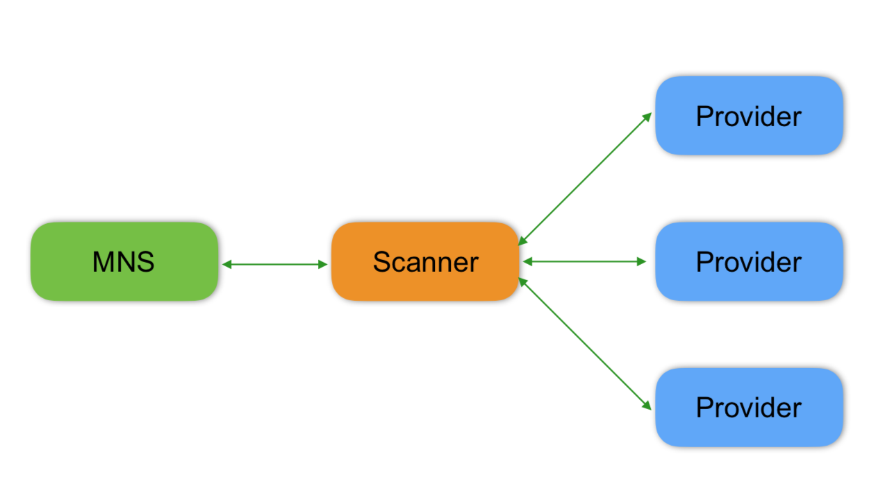
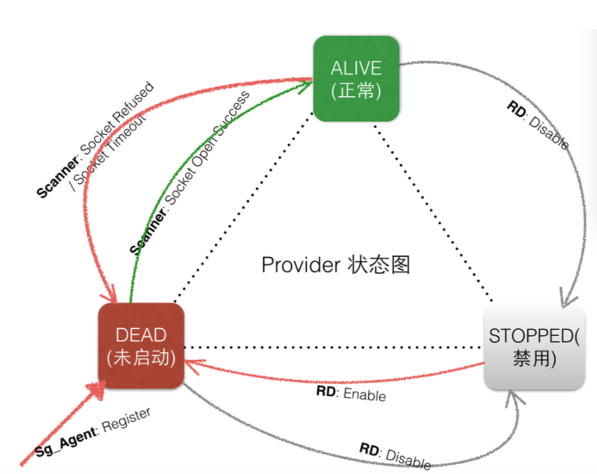

# OCTOScanner 介绍

## 背景描述
Scaner 是 OCTO 服务治理体系内的一个独立的服务健康检查子系统.

开发语言: Java

运行环境要求: JDK 1.8及以上、Maven3、ZooKeeper

组件依赖: [Dorado](https://github.com/Meituan-Dianping/octo-rpc/tree/master/dorado)

主要功能点:

1.持续检测 OCTO 系统内所有服务节点的端口存活状态, 并自动维护节点的状态信息


## 整体架构


## 设计细节
### 自定义心跳
对于 OCTO 系统内的服务提供者，Scanner支持使用应用层心跳来代替端口检测，能够更准确地判断服务节点的存活状态。

### 快慢线程
Scanner的扫描线程分为两类，正常节点和异常节点分为两个线程池扫描，用户也可以自定义两个线程池的线程数。

### 超时重试
对于检测超时的节点，Scanner会进行重试探测，避免网络抖动或闪断带来的影响

### 检测关键参数
   端口连通性检查 -> Socket Refused.
   端口超时检查 -> Socket Timeout
  
### 核心功能图示
1.Provider 状态转换图


## 快速上手
### 编译安装Dorado到本地Maven仓库
参考[Dorado 源码编译说明](https://github.com/Meituan-Dianping/octo-rpc/blob/master/dorado/dorado-doc/manual-developer/Compile.md)

### 打包运行Scanner
```bash
git clone git@github.com:Meituan-Dianping/octo-ns.git

cd octo-ns/scanner

mvn clean package -Dmaven.test.skip=true

cd target
#需要在启动参数中指定zookeeper地址，也可以在src/main/resources/application.yaml指定
java -Dzookeeper.url=xxx.xxx.xxx.xxx:xxxx -jar octo-scanner-0.0.1-SNAPSHOT.jar #日志会输出到当前路径下"octo-scanner/log/octo-scanner.log"文件

```


